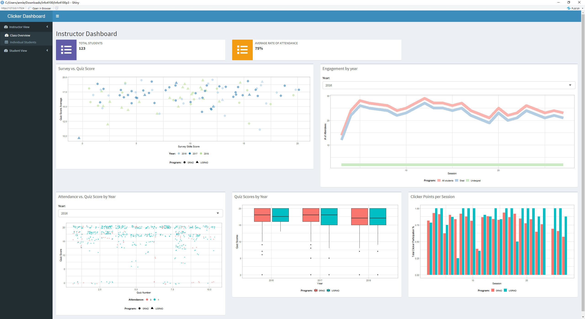
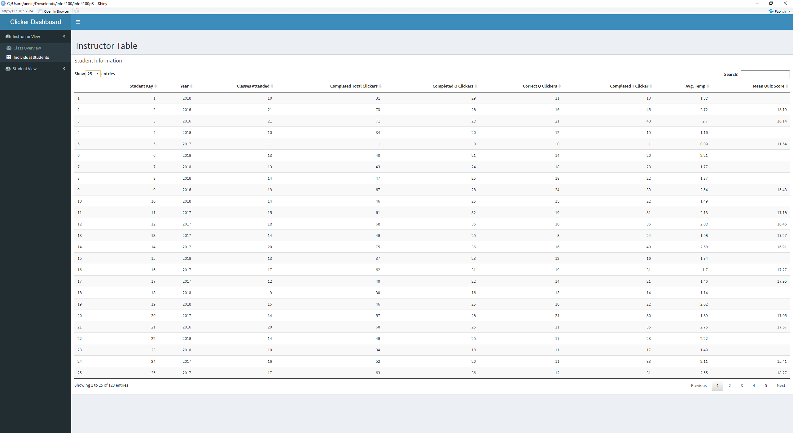
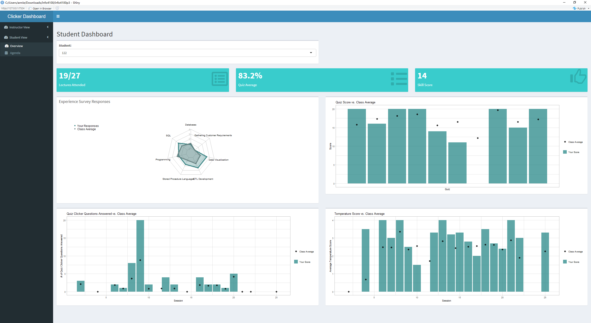
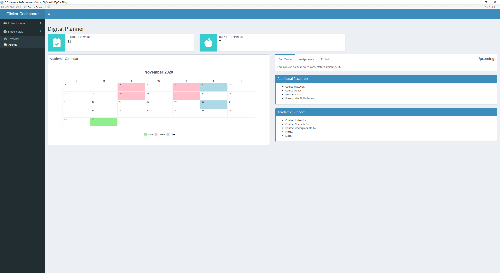

This project is about developing a learning analytics dashboard based on clicker data. You will work as a team to learn how to make a dashboard using R Shiny (official page with several tutorials: https://shiny.rstudio.com/tutorial/).

**Learning Objectives**

1. Understand the structure of clicker data
2. Create multiple different visualizations
3. Design and implement an instructor and student dashboard
4. Critically evaluate your own dashboard design

You are given aggregated clicker records for a CS course taught at Cornell. There are two datasets: the experience dataset and the quiz dataset.

**Scenario**

You are approached by a college instructor who uses iClickers in her CS class on Business Intelligence. She would like to gain insights about her students and how they are engaging/performing in order to better help them in class. She would also like to better support students by giving them feedback at scale about where they stand and perhaps how they compare to others in the class.

You offer to build a prototype of a dashboard using her clicker data: this is a dashboard for the instructor which offers an overview of the class characteristics, engagement, and performance; and it is a dashboard for students which offers a specific student an overview of their engagement and performance (and how it compares to others).

**Data**

The **experience dataset** contains one record per student who completed the CS course between 2016-2018. There are two sources to this dataset: Faculty Center and a Skills Survey (administered via the Blackboard LMS) where students self reported their skill level for various skills the first week of class. This data has been de-identified.  Name, netid, emplid, major have all been removed and replaced with a unique numeric identifier. Note that not all students completed the skills survey, they will have null values for the survey result fields.

|Attribute Name|Data Type|Definition|
|--------------|-------------|----------------------------------------------|
|student_key|numeric Unique key|Assigned as part of de-identification process.  Uniquely identifies student records for this data set only.|
|year|numeric|Four digit year student was enrolled in BI Class.|
|prog|character Values (GRAD, UGRAD)|Indicates whether the student was a graduate or undergraduate student when they were enrolled in BI course.|
|database_score|numeric (0-5)|Self reported experience level with database technology prior to taking course. 0= no experience, 5= expertise|
|sql_score|	numeric (0-5)|Self reported experience level with SQL prior to taking course. 0= no experience, 5=expertise|
|programing_score|numeric (0-5)|Self reported experience level with Any Programing language prior to taking course. 0=no experience, 5=expertise|
|stored_proc_score|	numeric (0-5)|Self reported experience level with stored procedure languages prior to taking course. 0=no experience, 5=expertise|
|etl_score|	numeric (0-5)|Self reported experience level with Extract Transform Load (ETL) development prior to taking course. 0=no experience, 5=expertise|
|data_vis_score|numeric (0-5)|Self reported experience level using data visualization tools prior to taking course. 0=no experience, 5=expertise|
|requirement_gather_score|numeric (0-5)|Self reported experience level gathering customer requirements prior to taking course. 0=no experience, 5=expertise|
|skill_survey_score|numeric|Sum of the self reported skill level scores.|

The **quiz dataset** contains one record per student per class session held where iClickers were used. Sources used in the creation of this data set include: iClicker session xml files, Blackboard gradebook (for quiz scores), and the Blackboard class schedule (used to map iClicker session to related quiz scores). Note that in some cases there are multiple iClicker sessions / lectures associated with a single quiz. This dataset may be joined to the experience dataset by the student_key field.

|Attribute Name|Data Type|Definition|
|--------------|-------------|----------------------------------------------|
|Acad_date_key|numeric|Date key in the form of YYYYMMDD indicating the date the class session was held.|
|student_key|numeric|Unique identifier for students who took BI class 2016-2018.  This key is the primary key for the experience_data file.|
|year|numeric|Four digit year class session was held.|
|session_number|numeric|Identifies the session number for a particular semester.  Session number is assigned by iClicker.|
|quiz_number|numeric|There are 10 quizzes throughout the BI course.  This attribute indicates which quiz is associated with the iClicker session(s).|
|attended|numeric (0,1)|Binary indicating whether the student attended that particular class session / lecture. 0=no, 1=yes.|
|total_possible_clicker|numeric|The total number of iClicker questions asked that session.|
|total_completed_clicker|numeric|The number of iClicker questions answered by student that session.|
|completed_q_clicker|numeric|The number of completed Quiz iClicker questions|
|correct_q_clicker|numeric|How many correct Quiz answers by student that session.|
|completed_t_clicker|number|How many Temperature questions answered by student that session. Temperature questions are 0-5, 0= bad, 5=great. There is no correct answer to Temperature questions, they are used to guage how students are feeling about a particular subject, assignment, etc.|
|avg_t_clicker|number|The average temperature answer by student for that session.  An average of 1 or 2 would be generally negative, while 4 or 5 would be generally positive responses.|
|quiz_score|numeric|Quiz score out of 20 points possible.|

```{r echo=FALSE, message=FALSE, warning=FALSE}
library(tidyverse)

# Below you are loading 2 new packages:shiny + shinydashboard.
# Install them once, then comment out the install command.

#install.packages("shiny")
library(shiny)

#install.packages("shinydashboard")
library(shinydashboard)

# fmsb for radar plots
#install.packages("fmsb")
library(fmsb)

#install.packages('DT')
library(DT)

#install.packages('RColorBrewer')
library(RColorBrewer)

#install.packages("calendR")
library(calendR)

# This should load the datasets:
# experience (123 by 11) and quiz (2423 by 13)
load("info4100.proj.dashboard.rda")

```

# Part 1: Planning / Sketching

Go through the planning / sketching process described in the reading about dashboards. While some dashboards are certainly better than others, there is not one correct solution here. However, spending enough time to make a concrete plan is essential for the success of your project. Everything you do to make the dashboards will be easier if you have a clear plan, especially because you will be splitting up the work and everyone needs to know what they should work on.

This is why you (each student but ideally as a team) should come to OH during the first week and get feedback on your plan with sketches.

**Question 1:** You will make a student dashboard and a teacher dashboard. Carefully consider the implications of this for design and content. To plan, answer the following prompts once for the student dashboard and then for the teacher dashboard. The more concrete you are here the easier it will be later. Focus on the concrete ideas that you will implement in the next steps. You can iterate on this step and modify your responses as your ideas for the dashboard become clearer. You should explore the dataset in R for 5-10 minutes to get a good sense of what the dataset has to offer.

*Planning for the student dashboard*

* For whom? Who will use it and what is their background?
    + Undergraduates enrolled in BI class
    + Graduates enrolled in BI class

* Why? What is the goal? What questions to answer?
    + Permit students to monitor their progress in the class
    + Show students their standing in the class as well as their comfort level with the material (based on temperature questions) as compared to others
    + Enable students to also "define goals and track progress towards these goals" (Verbert et al., 2014)

* What? What data to show and what is its structure?
    + experience dataset (student-level data): 7 self-reported scores (numeric, 0-5) for various coding skills and a total score (numeric), compared to other members of the course from 2016-2018 who completed the a survey
    + quiz dataset: iClicker data for the student in each class session indicating whether they attended the class (binary, 0,1), how many quizzes they completed (numeric), and their scores (numeric) compared to the total possible points (numeric) as well as their temperature checks (numeric, 0-5) for how they are feeling about the material

* How? How will visualizations support the goal?
    + Students can get a good sense of their progress from where they started based on their self-reported skill level in an area by viewing their reported comfort level with material as it is taught in class and their quiz scores.
    + Students can understand where they need to improve if they are behind their classmates in certain areas by comparing their scores to the average score for the class or the number of classes/questions they've missed compared to other students.

*Planning for the teacher dashboard*

* For whom? Who will use it and what is their background?
    + The instructor of the course will use the dashboard to monitor their students' progress.
    + Teaching assistants can check in on particular students in their sections/address any students who need extra help in the course.

* Why? What is the goal? What questions to answer?
    + How effective are the lectures at improving students' understanding of the material? Did one year work better than others?
    + Are students feeling more comfortable with the material compared to their confidence with it coming into the course?

* What? What data to show and what is its structure?
    + Class attendance (binary, 0,1) relationship to quiz scores/temperature checks
    + Student performance for various demographics (class year, grad/undergrad)
    + Student self-reported progress (survey scores vs. quiz scores)
    + Overall engagement (iClicker participation, attendance)

* How? How will visualizations support the goal?
    + Correlation between engagement and comfort level/achievement
    + Breakdown of data between program/year demographics

**Question 2:** Based on your plan above, make a sketch of what the dashboard would look like. See this week's readings for examples. Be detailed about what kinds of data points and visualizations you want to see in different parts of the page. Consider the user experience and how you should position more general information compared to more specific information, and where you may need some additional explanation to help the viewer understand a graphic, for example. In your sketch, it is useful to give labels to different objects, because in the steps below you can split up work between team members and the labels will help you connect the UI with the data objects. Show your sketches in OH to get credit for this question.

# Part 2: Dashboard Wire-frame Implementation

This is where you generate the dashboard layout. You are given a very basic wire frame example for the dashboard below. For more information on how R Shiny Dashboards work, look at https://rstudio.github.io/shinydashboard/get_started.html and https://rstudio.github.io/shinydashboard/structure.html. You can add different types of content into a `fuidRow()`. In the starter code, there are 2 rows of content: the first has two little info boxes; the second has two larger viz boxes. You can add more rows and change what is in them as you wish. Follow the naming convention, e.g. `inst.info1` is the first info box for instructors.

Your team can split up the tasks. Some work on creating the UI (this part), while others work on pre-processing the data and creating the statistics and visualizations that will populate the UI (next part).

**Question 3:** Create the layout for the dashboard tabs. You can have as many "tabs" as you like. Each tab is the content displayed when the user clicks on one of the menu items (so it is the page content). Here you are just specifying the wire frame i.e. **what goes where on the pages**, not what goes into it.

```{r}
#######################################
####### BEGIN INPUT: Question 3 #######
#######################################
# Example of a tab (i.e. page)
instructor_dash = tabItem(
    tabName = "instructor",
    h2("Instructor Dashboard"),

    # Dynamic infoBoxes
    fluidRow(
      infoBoxOutput("inst.info1"),
      infoBoxOutput("inst.info2")
    ),
    # Any visualization
    fluidRow(
        # box(
        #     title = "Box 1",
        #     plotOutput("inst.plot1", height = 250)
        # ),
        # box(
        #     title = "Box 2",
        #     plotOutput("inst.plot2", height = 250)
        # )
      box(
        title = "Survey vs. Quiz Score",
        plotOutput("survey_quiz_scatterplot")
      ),
      # box(
      #   title = "Engagement",
      #   plotOutput("engagement_line_plot")
      # ),
      box(
        title="Engagement by year",
        selectInput("year","Year:",list('2016'=2016,'2017'=2017,'2018'=2018)),
        plotOutput("engagement_line_plot_by_year"),
      ),
    ),
    fluidRow(
      # column(4,
      #   box(
      #     title = "Attendance vs. Quiz Score",
      #     plotOutput("attendance_quiz_scatterplot"),
      #     width = 15
      #   )),
      column(4,
        box(
          title = "Attendance vs. Quiz Score by Year",
          selectInput("attend_year","Year:",list('2016'=2016,'2017'=2017,'2018'=2018)),
          plotOutput("attendance_quiz_scatterplot_by_year"),
          width = 15
        )),
       column(4,
        box(
          title="Quiz Scores by Year",
          plotOutput("quiz_scores_year"),
          width = 15
        )),
       column(4,
        box(
          title="Clicker Points per Session",
          plotOutput("clicker_points_session"),
          width = 15
        ))
      )
)

instructor_dash_2 = tabItem(
    tabName = "instructor_2",
    h2("Instructor Table"),
    # Any visualization
    fluidRow(
      box(
        title = "Student Information ",
         dataTableOutput('instructor_table'),
        width = 30
      )
    )
  )

# Another empty tab
student_dash = tabItem(
  tabName = "student",
  h2("Student Dashboard"),
  fluidRow(
    box(
        selectInput("student","Student:",1:123)
    ),
  ),
  fluidRow(
      # A static valueBox
      #valueBox(10, "Quiz Completed", icon = icon("list-alt")),

      # Dynamic valueBoxes
      valueBoxOutput("quizBox"),
      valueBoxOutput("progressBox"),
      valueBoxOutput("approvalBox")
  ),
  fluidRow(
    box(
      title = "Experience Survey Responses",
      plotOutput("stud.plot1")
    ),
    box(plotOutput("quiz_score_plot")),
  ),
  fluidRow(
    box(plotOutput("quiz_plot")),
    box(plotOutput("temp_plot")),
  )
)

student_agenda = tabItem(
  tabName = "planner",
  h2("Digital Planner"),
  
  fluidRow(
      infoBoxOutput("lectures_remaining"),
      infoBoxOutput("quiz_remaining")
  ),
  
  fluidRow(
     ##calendar
      box(title = "Academic Calendar",
      plotOutput("calendar")),
      #calendarOutput("calendar")),
  
    tabBox(title = "Upcoming", id="tabset1",
           tabPanel("Quiz/Exams", "Lorem ipsum dolor sit amet, consectetur adipiscing elit."),
           tabPanel("Assignments", "Lorem ipsum dolor sit amet, consectetur adipiscing elit."),
           tabPanel("Projects", "Lorem ipsum dolor sit amet, consectetur adipiscing elit.")
           ),
    box(title = "Additional Resources", status = "primary", solidHeader = TRUE,
        uiOutput("resources")
        ),
    box(title = "Academic Support", status = "primary", solidHeader = TRUE,
        uiOutput("academic_support") 
        )
  ) 
)

#######################################
#######################################
```

# Part 3: Data Pre-processing

Get the data ready for use in the dashboard. Before the next stage, you want to have the data ready in the right format for simple computations and plotting. To do this effectively, you need to know by now what you want to display in each dashboard. However, this is also an iterative process. Once you have completed a first iteration of the design, you can come back to this step and add further pre-processing for more visualizations you like to add. This step is also an opportunity to better understand the structure of the datasets.

The instructor dashboard should show information for all students. The student dashboard is typically focused on an individual student. You can either pick a student (at random or intentionally) and use them as the "reference student" for the student dashboard. Or, a bit more ambitious but also more rewarding to try out, you can create an interactive dashboard in which you select the student and then the dashboard updates to show the information for that student. I would recommend you start with the simpler version and get that to work before you try to make it dynamic.

Use the space below to be ready for your information visualizations in the dashboards.

```{r}
#######################################
####### BEGIN INPUT             #######
#######################################

###student dashboard
student_level = na.omit(quiz) %>% group_by(STUDENT_KEY) %>% summarize(
  attended = sum(ATTENDED),
  total_clicker = sum(TOTAL_COMPLETED_CLICKER),
  q_clicker = sum(COMPLETED_Q_CLICKER),
  correct_q_clicker = sum(CORRECT_Q_CLICKER),
  t_clicker = sum(COMPLETED_T_CLICKER),
  avg_score = mean(QUIZ_SCORE)
)

quiz_score = na.omit(quiz %>% select(STUDENT_KEY, QUIZ_NUMBER, QUIZ_SCORE, YEAR)) %>% group_by(STUDENT_KEY, QUIZ_NUMBER) %>% summarize(
  score = mean(QUIZ_SCORE),
  year = mean(YEAR)
)

quiz_avg = na.omit(quiz %>% select(QUIZ_NUMBER, QUIZ_SCORE, YEAR))  %>% group_by(QUIZ_NUMBER,YEAR) %>% summarize(
  avg_score = mean(QUIZ_SCORE)
)

session_avg = quiz %>% select(ACAD_DATE_KEY, AVG_T_CLICKER,COMPLETED_Q_CLICKER, YEAR, SESSION_NUMBER)  %>% group_by(ACAD_DATE_KEY) %>% summarize(
  avg_t_clicker = mean(AVG_T_CLICKER),
  avg_q_clicker = mean(COMPLETED_Q_CLICKER),
  year = mean(YEAR),
  session = mean(SESSION_NUMBER)
)

exp_avg = na.omit(experience) %>% summarize(
  DATABASE_SCORE = mean(DATABASE_SCORE),
  SQL_SCORE = mean(SQL_SCORE),
  PROGRAMING_SCORE = mean(PROGRAMING_SCORE),
  STORED_PROC_SCORE = mean(STORED_PROC_SCORE),
  ETL_SCORE = mean(ETL_SCORE),
  DATA_VIS_SCORE = mean(DATA_VIS_SCORE),
  REQUIREMENT_GATHER_SCORE = mean(REQUIREMENT_GATHER_SCORE)
)
#names(exp_avg) = colnames(experience[-c(1:3,11)])

###Instructor dashboard
# quiz_instructor <- left_join(experience, quiz %>% dplyr::select(quiz_score), by = "STUDENT_KEY")
quiz_instructor <- left_join(experience, quiz, by = "STUDENT_KEY")
#quiz_instructor_edited <- quiz_instructor[!duplicated(quiz_instructor$STUDENT_KEY), ]
quiz_instructor_dropped <- na.omit(quiz_instructor)
quiz_scores <- quiz_instructor_dropped %>% select(STUDENT_KEY, QUIZ_SCORE, SKILL_SURVEY_SCORE, YEAR.x, PROG)  %>% group_by(STUDENT_KEY) %>%
  summarize(
    quiz_score_avg = mean(QUIZ_SCORE),
    quiz_score_total = sum(QUIZ_SCORE),
    survey_score = SKILL_SURVEY_SCORE,
    year = YEAR.x,
    prog = PROG
  )
quiz_scores <- quiz_scores[!duplicated(quiz_scores$STUDENT_KEY), ]
#this could be for all years or a specific year:
attendance_sums <- quiz_instructor %>% select(ATTENDED, SESSION_NUMBER, PROG, YEAR.x) %>% group_by(SESSION_NUMBER) %>%
  summarize(
    total_attended = sum(ATTENDED==1),
    ugrad_attended = sum(ATTENDED==1 & PROG=="UGRAD"),
    grad_attended = sum(ATTENDED==1 & PROG=="GRAD")
)
attendance_by_year <- quiz_instructor %>% select(ATTENDED, SESSION_NUMBER, PROG, YEAR.x) %>% group_by(SESSION_NUMBER,YEAR.x) %>%
  summarize(
    total_attended = sum(ATTENDED==1),
    ugrad_attended = sum(ATTENDED==1 & PROG=="UGRAD"),
    grad_attended = sum(ATTENDED==1 & PROG=="GRAD")
  )
clickers_instructors <- quiz_instructor %>% select(SESSION_NUMBER, PROG, YEAR.x, TOTAL_POSSIBLE_CLICKER, TOTAL_COMPLETED_CLICKER)  %>% group_by(SESSION_NUMBER, PROG, YEAR.x) %>%
  summarize(
    total_possible = (n() * TOTAL_POSSIBLE_CLICKER),
    total_completed = sum(TOTAL_COMPLETED_CLICKER),
    avg_clicker = sum(TOTAL_COMPLETED_CLICKER) / (n() * TOTAL_POSSIBLE_CLICKER),
    year = YEAR.x,
    session = SESSION_NUMBER,
    prog = PROG
  )
clickers_instructors <- clickers_instructors[!duplicated(clickers_instructors), ]

instructor_table_data <- quiz %>% select(STUDENT_KEY, ATTENDED, TOTAL_POSSIBLE_CLICKER, TOTAL_COMPLETED_CLICKER, COMPLETED_Q_CLICKER, CORRECT_Q_CLICKER, COMPLETED_T_CLICKER, AVG_T_CLICKER, QUIZ_SCORE, YEAR)  %>% group_by(STUDENT_KEY) %>%
  summarize(
    STUDENT_KEY = STUDENT_KEY,
    year = YEAR,
    attended = sum(ATTENDED==1),
    # total_possible_clicker = sum(TOTAL_POSSIBLE_CLICKER),
    total_completed_clicker = sum(TOTAL_COMPLETED_CLICKER),
    completed_q_clicker = sum(COMPLETED_Q_CLICKER),
    correct_q_clicker = sum(CORRECT_Q_CLICKER),
    completed_t_clicker = sum(COMPLETED_T_CLICKER),
    avg_t_clicker = mean(AVG_T_CLICKER),
    mean_quiz_score = mean(QUIZ_SCORE)
  )
instructor_table_data <- instructor_table_data[!duplicated(instructor_table_data), ]
instructor_table_data[,8] <-round(instructor_table_data[,8],2)
instructor_table_data[,9] <-round(instructor_table_data[,9],2)
colnames(instructor_table_data) <- c('Student Key', 'Year', 'Classes Attended', 'Completed Total Clickers', 'Completed Q Clickers', 'Correct Q Clickers', 'Completed T Clicker', 'Avg. Temp', 'Mean Quiz Score')


##Student Agenda content
calendar <-data.frame(
  date= seq(as.Date("2020-11-01"), as.Date("2020-11-30"), by=1)
)
calendar$day = factor(strftime(calendar$date, format = "%a"), levels=rev(c("Mon", "Tue", "Wed", "Thu", "Fri", "Sat", "Sun" )))
calendar$week = factor(strftime(calendar$date, format = "%V"))
calendar$month = strftime(calendar$date, format = "%B")
calendar$month = factor(calendar$month, levels = unique(calendar$month))
calendar$dom = factor(strftime(calendar$date, format="%d"))

# Vector of dates
dates <- seq(as.Date("2020-11-01"), as.Date("2020-11-30"), by = "1 day")

# Vector of NA and weekends
# (with the week starting on Monday)
#events <- ifelse(format(dates, "%w") %in% c(5, 6), "Weekend", NA)

# Adding more events
events <- ifelse(format(dates, "%w") %in% c(5, 6), NA, NA)
events[c(3, 5, 10, 12)] <- "Lecture"
events[c(6, 20)] <- "Quiz"
events[30] <- "Exam"
# instructor_table_data_averages <- quiz %>% select(STUDENT_KEY, ATTENDED, TOTAL_POSSIBLE_CLICKER, TOTAL_COMPLETED_CLICKER, COMPLETED_Q_CLICKER, CORRECT_Q_CLICKER, COMPLETED_T_CLICKER, AVG_T_CLICKER, QUIZ_SCORE, YEAR)  %>% group_by(YEAR) %>%
#   summarize(
#     year = YEAR,
#     attended = sum(ATTENDED==1),
#     # total_possible_clicker = sum(TOTAL_POSSIBLE_CLICKER),
#     total_completed_clicker = sum(TOTAL_COMPLETED_CLICKER),
#     completed_q_clicker = sum(COMPLETED_Q_CLICKER),
#     correct_q_clicker = sum(CORRECT_Q_CLICKER),
#     completed_t_clicker = sum(COMPLETED_T_CLICKER),
#     avg_t_clicker = mean(AVG_T_CLICKER),
#     mean_quiz_score = mean(QUIZ_SCORE)
#   )

#this could be for all years or a specific year:
#events
#######################################
#######################################
```

# Part 4: Prepare All Data Visualizations

This is where you create the content for the wire frames you created above. Again, you can refer to the examples and documentation in https://rstudio.github.io/shinydashboard/get_started.html and https://rstudio.github.io/shinydashboard/structure.html for guidance. You can also find many examples online just by searching with Google.

**Question 4:** For each of the pieces of content you planned for in the wire frames above, generate the relevant content. You need to assign them all to the `output` variable by referencing the name of the wire frame element you chose above like this `output$name.of.element`.

```{r}
server = function(input, output) {

#######################################
####### BEGIN INPUT: Question 4 #######
#######################################

    output$inst.info1 = renderInfoBox({
        infoBox("Total Students",
                length(unique(quiz$STUDENT_KEY)),
                icon = icon("list"), color = "purple")
    })

    output$inst.info2 = renderInfoBox({
        infoBox("Average Rate of Attendance",
                paste0(round(100 * mean(quiz$ATTENDED)), "%"),
                icon = icon("list"), color = "yellow")
    })

    output$inst.plot1 = renderPlot({
        hist(quiz$QUIZ_SCORE)
    })

    output$inst.plot2 = renderPlot({
        # I'm giving you three examples here
        # only the last one will be displayed
        # but you can try out each one.
        # As you can see, using ggplot allows you to
        # make much better-looking visualizations.

        # simple
        hist(quiz$TOTAL_COMPLETED_CLICKER)

        # using ggplot
        ggplot(quiz, aes(TOTAL_COMPLETED_CLICKER)) +
          geom_histogram()

        # using ggplot to make it clearer
        ggplot(quiz, aes(x = TOTAL_COMPLETED_CLICKER)) +
          geom_density(fill="gray") + # makes the density line and gray fill
          labs(x = "Completed Clicker Questions", y = "Density") + # change axis labels
          theme_classic() # to use white background
    })


  ### student dashboard
  output$quizBox <- renderValueBox({
    valueBox(
      paste0(sum(quiz[which(quiz$STUDENT_KEY==input$student),]$ATTENDED), "/27"), "Lectures Attended", icon = icon("list-alt"),
      color = "teal"
    )
  })  
  output$progressBox <- renderValueBox({
    valueBox(
      paste0(round(100*mean(na.omit(quiz[which(quiz$STUDENT_KEY==input$student),]$QUIZ_SCORE)))/20, "%"), "Quiz Average", icon = icon("list"),
      color = "teal"
    )
  })

  output$approvalBox <- renderValueBox({
    valueBox(
      experience[which(experience$STUDENT_KEY==input$student),]$SKILL_SURVEY_SCORE, "Skill Score", icon = icon("thumbs-up", lib = "glyphicon"),
      color = "teal"
    )
  })

  output$stud.plot1 = renderPlot({
    radarchart(rbind(rep(5,7), rep(0,7), as.data.frame(experience[which(experience$STUDENT_KEY==input$student),][,-c(1:3,11)]),exp_avg[,c(1:7)]),
    axistype=1 ,
    #custom polygon: student,average
    pcol=c(rgb(0.2,0.5,0.5,0.9), rgb(0.4,0.5,0.5,0.9)) , pfcol=c(rgb(0.2,0.5,0.5,0.3),rgb(0.4,0.5,0.5,0.3)) , plwd=c(4,4) , plty=c(1,1),

    #customize the grid
    cglcol="grey", cglty=1, axislabcol="grey", caxislabels=seq(0,5,1), cglwd=0.8,

    #custom labels
    vlcex=0.8,
    vlabels = c("Databases", "SQL", "Programming", "Stored Procedure Languages", "ETL Development", "Data Visualization", "Gathering Customer Requirements")
    )

    #add legend
    legend(x="topleft", legend = c("Your Responses", "Class Average"), bty = "n", pch=19 , col = c(rgb(0.2,0.5,0.5,0.9), rgb(0.4,0.5,0.5,0.9)), text.col = "black", cex=1)
  })


  output$quiz_score_plot <- renderPlot({
    #plot(quiz_score[which(quiz_score$STUDENT_KEY==input$student),]$score)

    #Score for each quiz; horizontal barplot
    ggplot(quiz_score[which(quiz_score$STUDENT_KEY==input$student),], aes(x = QUIZ_NUMBER, y = score)) +
          geom_bar(stat = "identity", fill="#f68060", alpha=.6, width=0.4) +
          coord_flip() +
          labs(x = "Quiz", y = "Score") # change axis labels
          theme_classic() # to use white background

    #Score for each quiz compared with class average
    barplot(rbind(quiz_score[which(quiz_score$STUDENT_KEY==input$student),]$score,quiz_avg$avg_score), beside=T, main = "Quiz Score vs. Class Average",
      xlab = "Quiz", #names = 1:10,
      ylab = "Score", legend = c("Your Score", "Class Average"),  
    )
    ggplot() +
    geom_bar(aes(x=quiz_score[which(quiz_score$STUDENT_KEY==input$student),]$QUIZ_NUMBER, y=quiz_score[which(quiz_score$STUDENT_KEY==input$student),]$score, linetype = "Your Score"),
           stat="identity",
           alpha=.7,
           fill="#197f80"
    ) +
    geom_point(aes(x=quiz_avg[which(quiz_avg$YEAR==as.numeric(quiz_score[which(quiz_score$STUDENT_KEY==input$student),][1,4])),]$QUIZ_NUMBER,y=quiz_avg[which(quiz_avg$YEAR==as.numeric(quiz_score[which(quiz_score$STUDENT_KEY==input$student),][1,4])),]$avg_score, shape = "Class Average"),
           stat="identity",
           alpha=.8,
           size=3
    ) +
    #scale_x_discrete(labels=quiz[which(quiz$STUDENT_KEY==input$student),]$SESSION_NUMBER) +
    scale_x_discrete(labels=1:10) +
    xlab("Quiz") +
    ylab("Score") +
    ggtitle("Quiz Score vs. Class Average") + 
    labs(shape=NULL, linetype=NULL) +
    theme_light()
  })

  output$quiz_plot <- renderPlot({
    ggplot() +
    geom_bar(aes(x=quiz[which(quiz$STUDENT_KEY==input$student),]$SESSION_NUMBER, y=quiz[which(quiz$STUDENT_KEY==input$student),]$COMPLETED_Q_CLICKER, linetype="Your Score"),
           stat="identity",
           alpha=.7,
           fill = "#197f80"
    ) +
    geom_point(aes(x=session_avg[which(session_avg$year==as.numeric(quiz[which(quiz$STUDENT_KEY==input$student),][1,3])),]$session,y=session_avg[which(session_avg$year==as.numeric(quiz[which(quiz$STUDENT_KEY==input$student),][1,3])),]$avg_q_clicker, 
                   shape="Class Average"),
           stat="identity",
           alpha=.8,
           size=3
    ) +
    #scale_x_discrete(labels=quiz[which(quiz$STUDENT_KEY==input$student),]$SESSION_NUMBER) +
    #scale_x_discrete(labels=2:23) +
    xlab("Session") +
    ylab("# of Quiz Clicker Questions Answered") +
    ggtitle("Quiz Clicker Questions Answered vs. Class Average") +
    labs(shape=NULL, linetype=NULL) +
    theme_light()


  })
  output$temp_plot <- renderPlot({
    ggplot() +
    geom_bar(aes(x=quiz[which(quiz$STUDENT_KEY==input$student),]$SESSION_NUMBER, y=quiz[which(quiz$STUDENT_KEY==input$student),]$AVG_T_CLICKER, linetype="Your Score"),
           stat="identity",
           alpha=.7,
           fill = "#197f80"
    ) +
    geom_point(aes(x=session_avg[which(session_avg$year==as.numeric(quiz[which(quiz$STUDENT_KEY==input$student),][1,3])),]$session,y=session_avg[which(session_avg$year==as.numeric(quiz[which(quiz$STUDENT_KEY==input$student),][1,3])),]$avg_t_clicker,
                   shape="Class Average"),
           stat="identity",
           alpha=.8,
           size=3
    ) +
    #scale_x_discrete(labels=quiz[which(quiz$STUDENT_KEY==input$student),]$SESSION_NUMBER) +
    #scale_x_discrete(labels=2:23) +
    xlab("Session") +
    ylab("Average Temperature Score") +
    ggtitle("Temperature Score vs. Class Average") +
    labs(shape=NULL, linetype=NULL) +
    theme_light()
  })

  
    ### Instructor dashboard
  #instructor: 1
  output$survey_quiz_scatterplot <- renderPlot({
    ggplot(quiz_scores, aes(alpha = 8/10, size=1.0)) +
    aes(x=survey_score, y=quiz_score_avg, shape = prog, color = factor(year)) +
    # add jitter to reduce overlap of points
    geom_point(position = position_jitter(w = 0.5, h = 0.5)) +
    labs(x = "Survey Skills Score", y = "Quiz Score Average", shape='Program:', color="Year:") +
    theme_light() +
    theme(legend.position="bottom", legend.direction = "horizontal", legend.box ="vertical",
          legend.title = element_text(face="bold")) +
    guides(alpha=FALSE, size=FALSE, shape=guide_legend(override.aes = list(size=4)), 
           color=guide_legend(override.aes = list(size=4))) +
    scale_color_brewer(type="qual", palette = 3)
  })
  
  #instructor: 2
  # output$engagement_line_plot <- renderPlot({
  #     ggplot(attendance_sums, aes(x=SESSION_NUMBER)) +
  #      geom_line(aes(y = total_attended, color = "All students")) + 
  #      geom_line(aes(y = grad_attended, color = "Grad")) + 
  #      geom_line(aes(y = ugrad_attended, color = "Undergrad")) +
  #      labs(x = "Session", y = "# of Attendees", color="Program:") +
  #   theme_light() +
  #   theme(legend.position="bottom", legend.direction = "horizontal", legend.box ="vertical",
  #         legend.title = element_text(face="bold")) +
  #   guides(color = guide_legend(override.aes = list(size=4))) +
  #   scale_color_brewer(type="qual", palette=4)
  #      # scale_color_discrete(name = "Students", labels = c("All Students", "Grads", "Undergrads"))
  #   })


  #instructor: 2(by year)
  output$engagement_line_plot_by_year <- renderPlot({
        ggplot(attendance_by_year[which(attendance_by_year$YEAR.x %in% input$year),], aes(x=SESSION_NUMBER)) +
       geom_line(aes(y = total_attended, color = "All students", size=0.3)) + 
       geom_line(aes(y = grad_attended, color = "Grad", size=0.3)) + 
       geom_line(aes(y = ugrad_attended, color = "Undergrad", size=0.3)) +
       labs(x = "Session", y = "# of Attendees", color= "Program:") +
    theme_light()+
    theme(legend.position="bottom", legend.direction = "horizontal", legend.box ="vertical",
          legend.title = element_text(face="bold")) + 
    guides(size = FALSE, color = guide_legend(override.aes = list(size=4))) +
    scale_color_brewer(type="qual", palette=4)
  })


  #instructor: 3
  # output$attendance_quiz_scatterplot <- renderPlot({
  #   ggplot(quiz_instructor, aes(x=QUIZ_NUMBER, y=QUIZ_SCORE, alpha = 3/10)) +    # maybe change size?
  #   # add jitter to reduce overlap of points
  #   geom_point(aes(shape=PROG, color=factor(ATTENDED)), position = position_jitter(h = 0.5)) +
  #   labs(x = "Quiz Number", y = "Quiz Score", shape="Program:", color="Attendance:") +
  #   theme_light() +
  #   theme(legend.position="bottom", legend.direction = "horizontal", legend.box ="vertical",
  #         legend.title = element_text(face="bold")) +
  #   guides(alpha=FALSE)
  # })
  
  #instructor: 3 (by year)
  
  output$attendance_quiz_scatterplot_by_year <- renderPlot({
    ggplot(quiz_instructor[which(quiz_instructor$YEAR.x %in% input$attend_year),], aes(x=QUIZ_NUMBER, y=QUIZ_SCORE, alpha = 5/10)) +    # maybe change size?
    # add jitter to reduce overlap of points
    geom_point(aes(shape=PROG, color=factor(ATTENDED)), position = position_jitter(h = 0.5)) +
    labs(x = "Quiz Number", y = "Quiz Score", shape="Program:", color="Attendance:") +
    theme_light() +
    theme(legend.position="bottom", legend.direction = "horizontal", legend.box ="vertical",
          legend.title = element_text(face="bold")) +
    guides(alpha=FALSE, color = guide_legend(override.aes = list(size=4)), 
           shape = guide_legend(override.aes = list(size=4)))
  })
  
  #instructor 4
   output$quiz_scores_year <- renderPlot({
     ggplot(quiz_instructor_dropped, aes(x=factor(YEAR.x), y=QUIZ_SCORE)) + 
      geom_boxplot(aes(fill=factor(PROG))) +
      labs(x = "Year", y = "Quiz Scores", fill="Program:") +
    theme_light() +
    theme(legend.position="bottom", legend.direction = "horizontal", legend.box ="vertical",
          legend.title = element_text(face="bold")) +
    scale_color_brewer(type="div")
   })
   
   #instructor 5
   output$clicker_points_session <- renderPlot({
    ggplot(data=clickers_instructors, aes(x=session, y=avg_clicker, fill=prog)) +  # could change the y-axis value
    geom_bar(stat="identity", position=position_dodge()) +
    labs(x = "Session", y = "Total Clicker Participation %", fill="Program:") +
    theme_light() +
    theme(legend.position="bottom", legend.direction = "horizontal", legend.box ="vertical",
          legend.title = element_text(face="bold")) +
    guides(fill = guide_legend(override.aes = list(size=4))) +
    scale_color_brewer(type="div")
   })

   #library(DT)
   #instructor table
   output$instructor_table<- renderDataTable(instructor_table_data,
        options = list(
          scrollX = TRUE
        )
      )
   
  #Student agenda 
  # output$calendar <- renderPlot({
  #   ggplot(calendar, aes(x=day, y=week)) +
  #     geom_text(aes(label=dom)) +
  #     facet_grid(~month, scales = "free_x") +
  #     theme_light()
  # })
  output$calendar <- renderPlot({
    calendR(year = 2020, month = 11,
        start = "S",
        title = "November 2020", 
        special.days = events,
        special.col = c("lightgreen", "pink", "lightblue"), 
        low.col = "white",
        weeknames = c("M", "T", "W", "T", "F", "S", "S"), 
        legend.pos = "bottom", # Legend position
        legend.title = "",     # Legend title
        col = "#f2f2f2",                  # Color of the lines of the calendar
        lwd = 1,                          # Width of the lines of the calendar
        lty = 1,                          # Line type of the lines of the calendar
        #font.family = "mono",             # Font family of all the texts                 
        font.style = "bold",              # Font style of the texts except the subtitle
        weeknames.col = "gray30",          # Color of the names of the days of the week
        months.col = "gray30",             # If month = NULL, is the color of the month names
        #days.col = 4,                     # Color of the number of the days
        day.size = 3.5)                   # Size of the number of days
  })
  output$lectures_remaining = renderInfoBox({
        infoBox("Lectures Remaining", sample(1:27,1),
                icon = icon("calendar-check"), color = "teal")
    })
  output$quiz_remaining = renderInfoBox({
        infoBox("Quizzes Remaining", sample(1:10,1),
                icon = icon("apple-alt"), color = "teal")
    })
  output$tabset1selected <- renderText({
    input$tabset1
  })
  output$academic_support = renderUI({
    HTML("<ul><li>Contact Instructor</li><li>Contact Graduate TA</li><li>Contact Undergraduate TA</li><li>Piazza</li><li>Slack</li></ul>")
  })
  output$resources = renderUI({
    HTML("<ul><li>Course Textbook</li><li>Course Videos</li><li>Extra Practice</li><li>Prerequisite Skills Review</li></ul>")
  })
#######################################
#######################################

}
```

# Part 5: Produce Dashboard and Reflect

You should be able to simply run the code below **as is** to see your dashboard.

**Note:** Unfortunately, you cannot knit this part into a pdf. So I added `eval=FALSE` to let the knitting run smoothly and you can submit your PDF.

```{r eval=FALSE}
#######################################
### This code creates the dashboard ###
#######################################

# Here we set up the Header of the dashboard
dhead = dashboardHeader(title = "Clicker Dashboard")

# Here set up the sidebar which has links to two pages
dside = dashboardSidebar(
  sidebarMenu(
    menuItem("Instructor View", tabName = "instructor", icon = icon("dashboard"),
             menuSubItem('Class Overview',
                          tabName = 'instructor',
                          icon = icon('dashboard')),
             menuSubItem(
                         'Individual Students',
                         tabName = 'instructor_2',
                         icon = icon('table'))
             ),
     menuItem("Student View", tabName = "student", icon = icon("dashboard"),
              menuSubItem("Overview", tabName = 'student', icon = icon('dashboard')),
              menuSubItem("Agenda",
                          tabName = 'planner',
                          icon = icon("calendar"))
  )
))


# Here we set up the body of the dashboard
dbody = dashboardBody(
    tabItems(
      student_dash,
      student_agenda,
      instructor_dash,
      instructor_dash_2
    )
)

# Combining header, sidebar, and body
ui = dashboardPage(dhead, dside, dbody)

# Generating a local instance of your dashboard
shinyApp(ui, server)
```

**Question 5:** Add screenshots of your group's dahsboards below using this syntax or simply add them to the Word document after knitting:










**Question 6:** Evaluate your group dashboard from the perspective of the instructor (teacher dashboard) and from the perspective of the student (student dashboard). What do you like about it, what would you change or add to it if you had more time?

*Reflection for the student dashboard*

* What do you like about it?
    + We like that students can see their scores on the experience survey, quizzes, and temperature questions compared to the class average, since it will help them know if their understanding of the material matches the rest of the class going in and as they learn the segments of new material. It's also nice that there are some simple figures at the top giving students information about their progress at a glance, and then more detailed graphs below to show them their scores for individual sessions.

* What would you change or add to it if you had more time?
    + It might be useful for students to see the undergraduate/graduate student breakout on the included graphs. It could also be helpful for them to be able to see the exact session number for each of their scores so that if they're worried about their standing, they can review the material from that session.

* What was the biggest challenge you faced? How did you address it?
    + We were confused about the quiz clicker questions vs. quiz scores per session, as well as some issues with positioning legends in a way that wouldn't detract from the student's view of the graphs presented, but we got some really useful answers in office hours clarifying the scores and were able to use online resources to figure out how to reposition legends.

*Reflection for the teacher dashboard*

* What do you like about it?
    + We like that that the instructors can look at a variety of different factors at once, in addition to looking at the correlation between factors such as Attendance vs. Quiz Score or Survey vs. Quiz Score. Additionally, we like that the instructors can see a differentiation in years as well as a clear difference in graduate and undergraduate students that allows the instructors to quickly and easily differentiation the strengths and weaknesses of these groups. Another feature that we added was a table for the instructors to see and search through all of the students. This table has information about the specific students and all of the other factors such as year, attendance, clicker questions completed, correct clicker questions and more.

* What would you change or add to it if you had more time?
    + If there was more time it might be useful to see quick percentages for different averages for quiz scores or attendance much like at the top of the student view where students can easily see their quiz average, lectures attended and skill score. By including a similar feature where the instructor could see quickly the average attendance for that year or the average quiz score quickly it might help the instructor to know more about their students quickly.

* What was the biggest challenge you faced? How did you address it?
    + A challenge was creating the original design when working with multiple factors such as the different years, to be able to see data for the current year and past years,  as well as the different types of students, with graduate students as as well as undergraduate students. We were able to address this by discussing our sketches in office hours and utilizing different types of graphs and their features such as the different axis and colors. We also addressed this issue by creating dynamic features for the different years in the engaement graph. Additionally in order to make the instructor view most useful but not too cluttered a separate page was created for the instructor table to allow for individual search while not overcrowding the original dashboard.

# Submit Project

Please **Knit a Docx report** that shows both the R code and R output and upload it on the EdX platform. Alternatively, you can Knit it as a "doc", open it in Word, and save that as a PDF.

**Important:** Be sure that all your code is visible. If the line is too long, it gets cut off. If that happens, organize your code on several lines.
